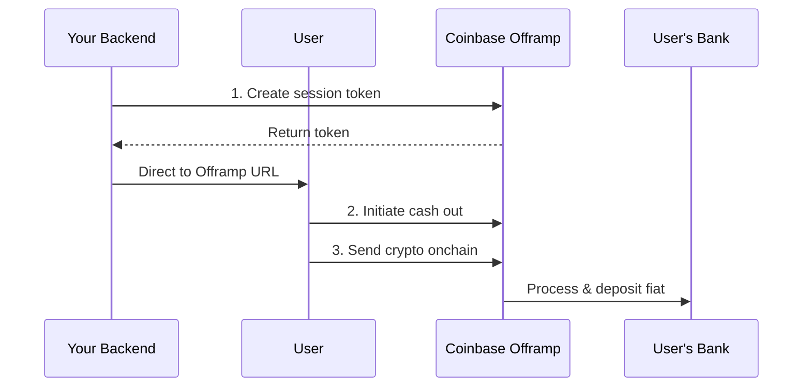

# Offramp: Overview
Source: https://docs.cdp.coinbase.com/onramp/offramp/offramp-overview

Coinbase Offramp allows your users to convert crypto into fiat currency and send funds directly to a bank account (ACH) or Coinbase account.

<Tip>
  **New to Offramp?** Start with the [Quickstart guide](/onramp/introduction/quickstart#try-offramp) to get up and running in minutes.
</Tip>

## How it works

The Offramp flow has three main steps:

1. **Create a session token** - Your backend generates a token with the user's wallet address
2. **User initiates cash out** - User visits Coinbase-hosted page and confirms the transaction
3. **Complete the transaction** - User sends crypto onchain to Coinbase, then receives fiat

<Warning>
  **Important:** Offramp requires users to send crypto from their wallet to a Coinbase-managed address. Your app must facilitate this onchain transaction. See the [Integration Guide](/onramp/offramp/offramp-integration-guide) for details.
</Warning>

## Integration options

Offramp is currently available as a **Coinbase-hosted experience** where users complete the cash out flow on a Coinbase-hosted page, then send crypto through your app.

**Key features:**

* ACH bank transfers or Coinbase account deposits
* Supports multiple cryptocurrencies and networks
* Real-time transaction status tracking
* 30-minute transaction window after initiation

<Info>
  For the complete integration flow including onchain transaction handling, see the [Integration Guide](/onramp/offramp/offramp-integration-guide).
</Info>

## What to read next

* **[Quickstart](/onramp/introduction/quickstart#try-offramp):** Get started with Offramp in minutes
* **[Integration Guide](/onramp/offramp/offramp-integration-guide):** Complete step-by-step implementation guide
* **[Transaction Status](/onramp/offramp/transaction-status):** Track and monitor offramp transactions
* **[Security Requirements](/onramp/security-requirements):** Implement CORS and authentication for production

