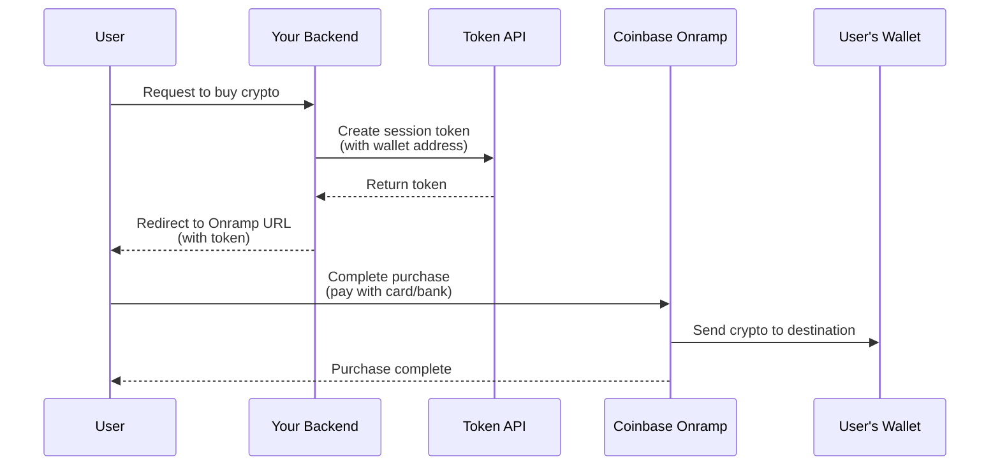

# Onramp: Overview
Source: https://docs.cdp.coinbase.com/onramp/onramp-overview

Coinbase Onramp allows your users to convert fiat currency into crypto and send it to any wallet. Users can onramp by logging in with their Coinbase account or using Guest Checkout with a debit card, Apple Pay, or Google Pay (no Coinbase account required).

<Tip>
  **New to Onramp?** Start with the [Quickstart guide](/onramp/introduction/quickstart) to get up and running in minutes.
</Tip>

<Card title="Apply for Onramp Access" icon="file-pen" href="https://support.cdp.coinbase.com/onramp-onboarding">
  To get full access to Coinbase Onramp & Offramp beyond trial mode limits, complete the onboarding form.
</Card>

## How it works

Whether you choose Coinbase-hosted or Headless Onramp, the basic flow is the same:

<Warning>
  **Important:** Session tokens are single-use and expire after 5 minutes. You must create a new token for each user session.
</Warning>

## Integration options

<CardGroup>
  <Card title="Coinbase-hosted Onramp" icon="browser" href="/onramp/coinbase-hosted-onramp/overview">
    **Easiest to integrate.** Redirect users to a Coinbase-hosted page where they complete purchases.

    * Card or Coinbase account payment methods
    * Up to \$2.5K weekly for cards (higher for Coinbase accounts)
    * Global for Coinbase users, US-only for guest checkout
    * No developer fees
  </Card>

  <Card title="Headless Onramp" icon="mobile" href="/onramp/headless-onramp/overview">
    **Native in-app experience.** Embed Apple Pay or Google Pay onramp directly in your iOS, Android, or web app.

    * Card payment methods only
    * Up to \$2.5K weekly for cards
    * US-only
    * Access fee required
  </Card>
</CardGroup>

<Tip>
  **Not sure which to choose?** Most developers start with Coinbase-hosted Onramp for quick integration. You can always add Headless Onramp later for specific use cases.
</Tip>

## What to read next

* **[Quickstart](/onramp/introduction/quickstart):** Get up and running with Coinbase-hosted Onramp in minutes
* **[Security Requirements](/onramp/security-requirements):** Implement CORS and authentication for production
* **[Webhooks](/onramp/core-features/webhooks):** Receive real-time transaction notifications
* **[Sandbox Testing](/onramp/additional-resources/sandbox-testing):** Test your integration without real funds

