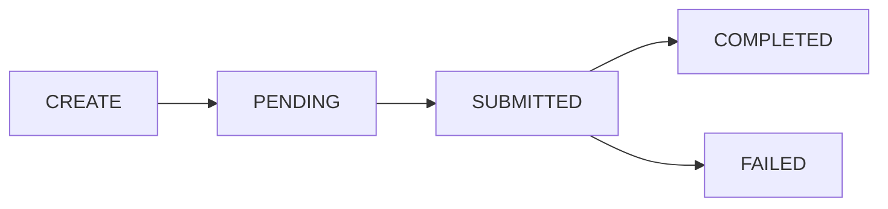

# Upgrade an EOA (EIP-7702)
Source: https://docs.cdp.coinbase.com/server-wallets/v2/evm-features/eip-7702-delegation


## Overview

[EIP-7702](https://eips.ethereum.org/EIPS/eip-7702) delegation upgrades an EVM EOA (Externally Owned Account) with smart account capabilities. After delegation, the EOA can:

* **Batch transactions**: send multiple calls in a single user operation
* **Use gas sponsorship**: leverage a paymaster so the user doesn't pay gas directly
* **Grant spend permissions**: optionally allow third parties to spend on the account's behalf

Unlike [ERC-4337 smart accounts](/server-wallets/v2/evm-features/smart-accounts), which create a separate contract account, EIP-7702 upgrades your **existing EOA in place** — the address stays the same.

<Tip>
  **Mainnet delegations are sponsored by Coinbase**, so your EOA does not need to hold any ETH before delegating on Base, Arbitrum, Ethereum, Optimism, or Polygon. Once delegated, pair with the [CDP Paymaster](/paymaster/introduction/welcome) on Base, or any [ERC-7677](https://eips.ethereum.org/EIPS/eip-7677)-compatible paymaster on other networks, to make user operations gasless too.

  **On testnets** (Base Sepolia, Ethereum Sepolia), the delegation transaction requires ETH in the EOA. Use the [CDP Faucet](/faucets/introduction/welcome) to fund your account before delegating.
</Tip>

## Prerequisites

It is assumed you have already completed the [Quickstart](/server-wallets/v2/introduction/quickstart) guide.

## Operation lifecycle

Delegation is asynchronous. When you create a delegation, the API returns an operation ID immediately while the transaction is submitted and confirmed onchain. You poll the operation until it reaches `COMPLETED`, at which point the account is ready to send user operations.



| Status      | Meaning                                                                         |
| ----------- | ------------------------------------------------------------------------------- |
| `PENDING`   | The delegation operation has been created but not yet submitted to the network. |
| `SUBMITTED` | The delegation transaction has been submitted to the network.                   |
| `COMPLETED` | The delegation is active. The account can now submit user operations.           |
| `FAILED`    | The delegation failed.                                                          |

## 1. Create an EIP-7702 delegation

<CodeGroup>
  ```ts main.ts theme={null}
  import { CdpClient } from "@coinbase/cdp-sdk";
  import dotenv from "dotenv";

  dotenv.config();

  const cdp = new CdpClient();

  const account = await cdp.evm.getOrCreateAccount({ name: "My-EIP7702-Account" });
  console.log("Account address:", account.address);

  const { delegationOperationId } = await cdp.evm.createEvmEip7702Delegation({
    address: account.address,
    network: "base-sepolia",
    enableSpendPermissions: false, // optional, defaults to false
  });

  console.log("Delegation operation created:", delegationOperationId);
  ```

  ```python main.py theme={null}
  import asyncio
  from cdp import CdpClient
  from dotenv import load_dotenv

  load_dotenv()

  async def main():
      async with CdpClient() as cdp:
          account = await cdp.evm.get_or_create_account(name="My-EIP7702-Account")
          print(f"Account address: {account.address}")

          delegation_operation_id = await cdp.evm.create_evm_eip7702_delegation(
              address=account.address,
              network="base-sepolia",
              enable_spend_permissions=False,  # optional, defaults to False
          )

          print(f"Delegation operation created: {delegation_operation_id}")

  asyncio.run(main())
  ```
</CodeGroup>

### Parameters

| Parameter              | Type      | Description                                                                                                                                       |
| ---------------------- | --------- | ------------------------------------------------------------------------------------------------------------------------------------------------- |
| address                | `string`  | The 0x-prefixed address of the EOA account to delegate.                                                                                           |
| network                | `string`  | The network for the delegation (e.g. `"base-sepolia"`, `"base"`). See [supported networks](#supported-networks).                                  |
| enableSpendPermissions | `boolean` | Whether to enable [spend permissions](/server-wallets/v2/evm-features/spend-permissions) on the delegated account. Optional, defaults to `false`. |
| idempotencyKey         | `string`  | An idempotency key for safe retries. Optional.                                                                                                    |

**Returns:** `{ delegationOperationId: string }`

## 2. Poll for delegation completion

Use the wait method to poll the delegation operation until it reaches a terminal state (`COMPLETED` or `FAILED`).

<CodeGroup>
  ```ts main.ts theme={null}
  const operation = await cdp.evm.waitForEvmEip7702DelegationOperationStatus({
    delegationOperationId,
    waitOptions: {           // optional
      timeoutSeconds: 60,    // default: 60
      intervalSeconds: 0.2,  // default: 0.2
    },
  });

  console.log("Delegation status:", operation.status);
  console.log("Transaction hash:", operation.transactionHash);
  ```

  ```python main.py theme={null}
  operation = await cdp.evm.wait_for_evm_eip7702_delegation_operation_status(
      delegation_operation_id=delegation_operation_id,
      timeout_seconds=60,      # optional, default: 60
      interval_seconds=0.2,    # optional, default: 0.2
  )

  print(f"Delegation status: {operation.status}")
  print(f"Transaction hash: {operation.transaction_hash}")
  ```
</CodeGroup>

You can also check the status of a delegation operation at any time without waiting:

<CodeGroup>
  ```ts main.ts theme={null}
  const operation = await cdp.evm.getEvmEip7702DelegationOperationStatus(
    delegationOperationId,
  );

  console.log(operation.status);
  // => "PENDING" | "SUBMITTED" | "COMPLETED" | "FAILED"
  ```

  ```python main.py theme={null}
  operation = await cdp.evm.get_evm_eip7702_delegation_operation_status(
      delegation_operation_id=delegation_operation_id,
  )

  print(operation.status)
  # => "PENDING" | "SUBMITTED" | "COMPLETED" | "FAILED"
  ```
</CodeGroup>

### Response: `EvmEip7702DelegationOperation`

| Field                 | Type     | Description                                                                    |
| --------------------- | -------- | ------------------------------------------------------------------------------ |
| delegationOperationId | `string` | Unique identifier for the delegation operation.                                |
| status                | `string` | One of: `PENDING`, `SUBMITTED`, `COMPLETED`, `FAILED`.                         |
| transactionHash       | `string` | The hash of the delegation transaction. Present once submitted to the network. |
| network               | `string` | The network the delegation was created on.                                     |
| delegateAddress       | `string` | The address the account has delegated to. Present when delegation is active.   |

## 3. Use the delegated account

After the delegation completes, convert the server account to a delegated account view using `toEvmDelegatedAccount`. This lets you call smart account methods like `sendUserOperation`.

<CodeGroup>
  ```ts main.ts [expandable] theme={null}
  import { CdpClient, toEvmDelegatedAccount } from "@coinbase/cdp-sdk";
  import { parseEther } from "viem";

  // ... (after delegation completes)

  const delegatedAccount = toEvmDelegatedAccount(account);

  const { userOpHash } = await delegatedAccount.sendUserOperation({
    network: "base-sepolia",
    calls: [
      {
        to: "0x0000000000000000000000000000000000000000",
        value: parseEther("0"),
        data: "0x",
      },
    ],
  });

  console.log("User operation submitted:", userOpHash);
  ```

  ```python main.py [expandable] theme={null}
  from cdp import to_evm_delegated_account
  from cdp.evm_call_types import EncodedCall

  # ... (after delegation completes)

  delegated = to_evm_delegated_account(account)

  user_op = await delegated.send_user_operation(
      calls=[
          EncodedCall(
              to="0x0000000000000000000000000000000000000000",
              value=0,
              data="0x",
          )
      ],
      network="base-sepolia",
  )

  print(f"User operation submitted: {user_op.user_op_hash}")
  ```
</CodeGroup>

## Full end-to-end example

This example creates an EOA, funds it, delegates it with EIP-7702, and sends a user operation from the upgraded account.

### Testnet (Base Sepolia)

<Note>
  The delegation transaction on Base Sepolia requires ETH in the EOA. The example below requests funds from the [CDP Faucet](/faucets/introduction/welcome) automatically if the balance is zero.
</Note>

<CodeGroup>
  ```ts main.ts [expandable] theme={null}
  import { CdpClient, toEvmDelegatedAccount } from "@coinbase/cdp-sdk";
  import { createPublicClient, http, parseEther } from "viem";
  import { baseSepolia } from "viem/chains";
  import dotenv from "dotenv";

  dotenv.config();

  const cdp = new CdpClient();

  const publicClient = createPublicClient({
    chain: baseSepolia,
    transport: http(),
  });

  // Step 1: Get or create an EOA account
  const account = await cdp.evm.getOrCreateAccount({ name: "EIP7702-Example-Account" });
  console.log("Account address:", account.address);

  // Step 2: Ensure the account has ETH for gas (request faucet if needed)
  const balance = await publicClient.getBalance({ address: account.address });
  if (balance === 0n) {
    console.log("Requesting ETH from faucet...");
    const { transactionHash: faucetTxHash } = await cdp.evm.requestFaucet({
      address: account.address,
      network: "base-sepolia",
      token: "eth",
    });

    await publicClient.waitForTransactionReceipt({ hash: faucetTxHash });
    console.log("Faucet transaction confirmed.");
    await new Promise(resolve => setTimeout(resolve, 1000));
  }

  // Step 3: Create the EIP-7702 delegation
  console.log("Creating EIP-7702 delegation...");
  const { delegationOperationId } = await cdp.evm.createEvmEip7702Delegation({
    address: account.address,
    network: "base-sepolia",
    enableSpendPermissions: false,
  });

  console.log("Delegation operation created:", delegationOperationId);

  // Step 4: Wait for the delegation operation to complete
  console.log("Waiting for delegation to complete...");
  const delegationOperation = await cdp.evm.waitForEvmEip7702DelegationOperationStatus({
    delegationOperationId,
  });

  console.log(
    `Delegation is complete (status: ${delegationOperation.status}). Explorer: https://sepolia.basescan.org/tx/${delegationOperation.transactionHash}`,
  );

  // Step 5: Send a user operation using the upgraded EOA (via toEvmDelegatedAccount)
  console.log("Sending user operation with upgraded EOA...");
  const delegatedAccount = toEvmDelegatedAccount(account);
  const { userOpHash } = await delegatedAccount.sendUserOperation({
    network: "base-sepolia",
    calls: [
      {
        to: "0x0000000000000000000000000000000000000000",
        value: parseEther("0"),
        data: "0x",
      },
    ],
  });

  console.log("User operation submitted:", userOpHash);
  console.log(`Check status: https://base-sepolia.blockscout.com/op/${userOpHash}`);
  ```

  ```python main.py [expandable] theme={null}
  import asyncio
  from web3 import Web3
  from cdp import CdpClient, to_evm_delegated_account
  from cdp.evm_call_types import EncodedCall
  from dotenv import load_dotenv

  load_dotenv()

  w3 = Web3(Web3.HTTPProvider("https://sepolia.base.org"))

  async def main():
      async with CdpClient() as cdp:
          # Step 1: Get or create an EOA account
          account = await cdp.evm.get_or_create_account(name="EIP7702-Example-Account-Python")
          print(f"Account address: {account.address}")

          # Step 2: Ensure the account has ETH for gas (request faucet if needed)
          balance = w3.eth.get_balance(account.address)
          if balance == 0:
              print("Requesting ETH from faucet...")
              faucet_hash = await cdp.evm.request_faucet(
                  address=account.address,
                  network="base-sepolia",
                  token="eth",
              )
              w3.eth.wait_for_transaction_receipt(faucet_hash)
              print("Faucet transaction confirmed.")

          # Step 3: Create the EIP-7702 delegation
          await asyncio.sleep(1)
          print("Creating EIP-7702 delegation...")
          delegation_operation_id = await cdp.evm.create_evm_eip7702_delegation(
              address=account.address,
              network="base-sepolia",
              enable_spend_permissions=False,
          )

          print(f"Delegation operation created: {delegation_operation_id}")

          # Step 4: Wait for the delegation operation to complete
          print("Waiting for delegation to complete...")
          delegation_operation = await cdp.evm.wait_for_evm_eip7702_delegation_operation_status(
              delegation_operation_id=delegation_operation_id,
          )

          print(
              f"Delegation is complete (status: {delegation_operation.status}). "
              f"Explorer: https://sepolia.basescan.org/tx/{delegation_operation.transaction_hash}"
          )

          # Step 5: Send a user operation using the upgraded EOA (via to_evm_delegated_account)
          print("Sending user operation with upgraded EOA...")
          delegated = to_evm_delegated_account(account)
          user_op = await delegated.send_user_operation(
              calls=[
                  EncodedCall(
                      to="0x0000000000000000000000000000000000000000",
                      value=0,
                      data="0x",
                  )
              ],
              network="base-sepolia",
          )

          print(f"User operation submitted: {user_op.user_op_hash}")
          print(f"Check status: https://base-sepolia.blockscout.com/op/{user_op.user_op_hash}")

  if __name__ == "__main__":
      asyncio.run(main())
  ```
</CodeGroup>

### Mainnet (Base)

<Tip>
  No ETH required. Coinbase sponsors mainnet delegation transactions.
</Tip>

<CodeGroup>
  ```ts main.ts [expandable] theme={null}
  import { CdpClient, toEvmDelegatedAccount } from "@coinbase/cdp-sdk";
  import { parseEther } from "viem";
  import dotenv from "dotenv";

  dotenv.config();

  const cdp = new CdpClient();

  // Step 1: Get or create an EOA account
  const account = await cdp.evm.getOrCreateAccount({ name: "EIP7702-Example-Account" });
  console.log("Account address:", account.address);

  // Step 2: Create the EIP-7702 delegation
  console.log("Creating EIP-7702 delegation...");
  const { delegationOperationId } = await cdp.evm.createEvmEip7702Delegation({
    address: account.address,
    network: "base",
    enableSpendPermissions: false,
  });

  console.log("Delegation operation created:", delegationOperationId);

  // Step 3: Wait for the delegation operation to complete
  console.log("Waiting for delegation to complete...");
  const delegationOperation = await cdp.evm.waitForEvmEip7702DelegationOperationStatus({
    delegationOperationId,
  });

  console.log(
    `Delegation is complete (status: ${delegationOperation.status}). Explorer: https://basescan.org/tx/${delegationOperation.transactionHash}`,
  );

  // Step 4: Send a user operation using the upgraded EOA (via toEvmDelegatedAccount)
  console.log("Sending user operation with upgraded EOA...");
  const delegatedAccount = toEvmDelegatedAccount(account);
  const { userOpHash } = await delegatedAccount.sendUserOperation({
    network: "base",
    calls: [
      {
        to: "0x0000000000000000000000000000000000000000",
        value: parseEther("0"),
        data: "0x",
      },
    ],
  });

  console.log("User operation submitted:", userOpHash);
  console.log(`Check status: https://base.blockscout.com/op/${userOpHash}`);
  ```

  ```python main.py [expandable] theme={null}
  import asyncio
  from cdp import CdpClient, to_evm_delegated_account
  from cdp.evm_call_types import EncodedCall
  from dotenv import load_dotenv

  load_dotenv()

  async def main():
      async with CdpClient() as cdp:
          # Step 1: Get or create an EOA account
          account = await cdp.evm.get_or_create_account(name="EIP7702-Example-Account-Python")
          print(f"Account address: {account.address}")

          # Step 2: Create the EIP-7702 delegation
          print("Creating EIP-7702 delegation...")
          delegation_operation_id = await cdp.evm.create_evm_eip7702_delegation(
              address=account.address,
              network="base",
              enable_spend_permissions=False,
          )

          print(f"Delegation operation created: {delegation_operation_id}")

          # Step 3: Wait for the delegation operation to complete
          print("Waiting for delegation to complete...")
          delegation_operation = await cdp.evm.wait_for_evm_eip7702_delegation_operation_status(
              delegation_operation_id=delegation_operation_id,
          )

          print(
              f"Delegation is complete (status: {delegation_operation.status}). "
              f"Explorer: https://basescan.org/tx/{delegation_operation.transaction_hash}"
          )

          # Step 4: Send a user operation using the upgraded EOA (via to_evm_delegated_account)
          print("Sending user operation with upgraded EOA...")
          delegated = to_evm_delegated_account(account)
          user_op = await delegated.send_user_operation(
              calls=[
                  EncodedCall(
                      to="0x0000000000000000000000000000000000000000",
                      value=0,
                      data="0x",
                  )
              ],
              network="base",
          )

          print(f"User operation submitted: {user_op.user_op_hash}")
          print(f"Check status: https://base.blockscout.com/op/{user_op.user_op_hash}")

  if __name__ == "__main__":
      asyncio.run(main())
  ```
</CodeGroup>

## Supported networks

<CardGroup>
  <Card title="Mainnets" icon="globe">
    Arbitrum, Base, Ethereum, Optimism, Polygon

    Delegation transactions are **sponsored by Coinbase**, so no ETH is required. Pair with the [CDP Paymaster](/paymaster/introduction/welcome) on Base, or a custom [ERC-7677](https://eips.ethereum.org/EIPS/eip-7677) paymaster on other networks, for fully gasless user operations.
  </Card>

  <Card title="Testnets" icon="flask">
    Base Sepolia, Ethereum Sepolia

    The EOA must hold ETH to pay for the delegation transaction. Use the [CDP Faucet](/faucets/introduction/welcome) to fund your account.
  </Card>
</CardGroup>

## EIP-7702 vs ERC-4337 smart accounts

| Aspect                | EIP-7702 Delegation                      | ERC-4337 Smart Account                |
| --------------------- | ---------------------------------------- | ------------------------------------- |
| **Address**           | Same EOA address, upgraded in place      | New contract address                  |
| **Account type**      | EOA with smart account capabilities      | Standalone smart contract             |
| **Creation**          | Delegation operation on existing account | Separate smart account creation       |
| **Ownership**         | Self-owned (the EOA is the account)      | Requires a separate owner account     |
| **User operations**   | Supported after delegation               | Supported after first user operation  |
| **Spend permissions** | Optional via `enableSpendPermissions`    | Optional via `enableSpendPermissions` |

## What to read next

* [**Smart Accounts**](/server-wallets/v2/evm-features/smart-accounts): Learn about ERC-4337 Smart Accounts
* [**Spend Permissions**](/server-wallets/v2/evm-features/spend-permissions): Configure spending limits for delegated accounts
* [**Gas Sponsorship**](/server-wallets/v2/evm-features/gas-sponsorship): Sponsor gas fees for your users' transactions

