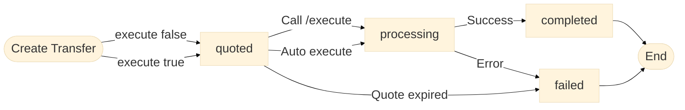

# Overview
Source: https://docs.cdp.coinbase.com/api-reference/payment-apis/rest-api/transfers/transfers


**Transfers** represent both the request and execution of fund transfers from a source to a target. They provide upfront fee quotes and track the complete lifecycle from initiation through completion or failure.

## Lifecycle

Transfers move through a simple lifecycle from quote to execution outcome.



### Transfer statuses

Each transfer status tells you where the transfer is in its lifecycle and what action (if any) is needed.

| Transfer status | Description                                                                                                         | Recommended action                                                                                                                             |
| --------------- | ------------------------------------------------------------------------------------------------------------------- | ---------------------------------------------------------------------------------------------------------------------------------------------- |
| `quoted`        | Transfer is quoted. This can be a waiting state (`execute: false`) or transient before execution (`execute: true`). | If manual, call [Execute a Transfer](/api-reference/payment-apis/rest-api/transfers-under-development/execute-a-transfer) before quote expiry. |
| `processing`    | Transfer is executing.                                                                                              | No action needed; monitor via [Webhooks](/api-reference/payment-apis/webhooks).                                                                |
| `completed`     | Transfer completed successfully.                                                                                    | No action needed.                                                                                                                              |
| `failed`        | Transfer failed due to execution error or quote expiry.                                                             | Inspect `failureReason`, review [Errors](/api-reference/payment-apis/errors), then create a new transfer if needed.                            |

### Execution modes

Execution mode controls whether a quoted transfer auto-executes or waits for manual execution.

| Execution mode   | Initial behavior                                   | What you do next                                                              |
| ---------------- | -------------------------------------------------- | ----------------------------------------------------------------------------- |
| `execute: true`  | Transfer is quoted, then auto-executes.            | Monitor status via webhooks.                                                  |
| `execute: false` | Transfer remains in `quoted` until you execute it. | Review quote/fees, then call `/v2/transfers/{transferId}/execute` when ready. |

## Before execution

### Fee quotes

Every transfer provides a comprehensive fee quote in the `fees` array. This allows you to show users exactly what they'll pay before any money moves.

To review fees before execution:

1. Create a transfer with `execute: false`
2. Review the `fees` array in the response
3. Call `POST /v2/transfers/{transferId}/execute` when ready to proceed

For automatic execution without fee review, create a transfer with `execute: true`.

### Transfer validation

Use `validateOnly: true` to validate transfer parameters without initiating or persisting a transfer. This is useful when you need a preflight check before execution.

<Note>
  `validateOnly` and `execute` are mutually exclusive. Setting both to `true` returns a `400` error.
</Note>

See [Transfer Validation](/api-reference/payment-apis/rest-api/transfers/validation) for complete request/response examples, validation errors, and sandbox guidance.

## Calculation concepts

### Amount type

The `amountType` field specifies whether the given amount is received by the target or taken from the source:

* **`source`** (default): The target receives the amount minus any fees
* **`target`**: The target receives the exact amount specified; fees are added to the amount taken from the source

**Example**: To send exactly \$100 to the recipient (with fees paid separately):

```json theme={null}
{
  "amount": "100.00",
  "amountType": "target"
}
```

### Fees

Each fee in the `fees` array has a `type` indicating its purpose:

| Fee Type     | Description                                         |
| ------------ | --------------------------------------------------- |
| `bank`       | Traditional banking fees (e.g., wire transfer fees) |
| `conversion` | Asset conversion/exchange fees                      |
| `network`    | Blockchain network fees (gas costs)                 |
| `other`      | Other processing fees                               |

**Example fees array:**

```json theme={null}
{
  "fees": [
    { "type": "bank", "amount": "15.00", "asset": "usd" },
    { "type": "conversion", "amount": "1.00", "asset": "usd" },
    { "type": "network", "amount": "0.001", "asset": "eth" }
  ]
}
```

**Fee expiration**: Fee quotes are valid for a limited time. The `expiresAt` field shows exactly when the fee quote will expire. If you don't execute before this time, you'll need to create a new transfer to get updated fees.

### Exchange rate

For transfers involving currency conversion, the `exchangeRate` object provides rate information:

```json theme={null}
{
  "exchangeRate": {
    "sourceAsset": "usd",
    "targetAsset": "btc",
    "rate": "0.00001"
  }
}
```

The `rate` indicates how many units of the target asset equal one unit of the source asset.

## Outcomes

### Transfer completion

When a transfer reaches `completed` status, it contains the final execution details:

* `completedAt` - When the transfer finished
* `executedAt` - When the transfer moved from `quoted` to `processing`
* `targetAmount` - The actual amount delivered to the target
* `details` - Additional information (e.g., deposit destination reference)

**Example completed payload (with deposit details):**

```json theme={null}
{
  "transferId": "transfer_af2937b0-9846-4fe7-bfe9-ccc22d935114",
  "status": "completed",
  "source": {
    "address": "0x833589fCD6eDb6E08f4c7C32D4f71b54bdA02913",
    "network": "base",
    "asset": "usdc"
  },
  "target": {
    "accountId": "account_af2937b0-9846-4fe7-bfe9-ccc22d935114",
    "asset": "usdc"
  },
  "sourceAmount": "100.00",
  "sourceAsset": "usdc",
  "targetAmount": "100.00",
  "targetAsset": "usdc",
  "completedAt": "2026-01-01T00:05:00Z",
  "executedAt": "2026-01-01T00:01:30Z",
  "createdAt": "2026-01-01T00:00:00Z",
  "updatedAt": "2026-01-01T00:05:00Z",
  "details": {
    "depositDestination": {
      "id": "depositDestination_af2937b0-9846-4fe7-bfe9-ccc22d935114"
    },
    "onchainTransactions": [
      {
        "transactionHash": "0x363cd3b3d4f49497cf5076150cd709307b90e9fc897fdd623546ea7b9313cecb",
        "network": "base"
      }
    ]
  }
}
```

### Failure details

When a transfer fails, the `failureReason` field contains a human-readable description of what went wrong.

A transfer can reach `failed` status in two ways:

* **Execution error** — the transfer was executing and encountered an error (e.g., insufficient balance, network failure).
* **Quote expiration** — the transfer was in `quoted` status and the fee quote expired before `/execute` was called. Create a new transfer to get a fresh quote.

**Example:**

```json theme={null}
{
  "status": "failed",
  "failureReason": "Insufficient balance to complete this transfer."
}
```

## Travel rule

For transfers that require travel rule compliance, use the `travelRule` object:

| Field            | Description                                                 |
| ---------------- | ----------------------------------------------------------- |
| `isSelf`         | Whether the receiving wallet belongs to the sender          |
| `isIntermediary` | Whether Coinbase is acting as an intermediary VASP          |
| `originator`     | Information about the sender (name, address, VASP details)  |
| `beneficiary`    | Information about the receiver (name, address, wallet type) |

**When to set `isIntermediary: true`:**

Set this when your organization is a VASP using Coinbase to send crypto on behalf of your end customer. In this scenario, you must provide the `originator` object with:

* Originator name and address
* Your VASP information (`virtualAssetServiceProvider` with `name`, `address`, `identifier`)

**Example:**

```json theme={null}
{
  "travelRule": {
    "isSelf": false,
    "isIntermediary": true,
    "originator": {
      "name": "John Doe",
      "address": {
        "line1": "123 Main St",
        "city": "San Francisco",
        "postCode": "94105",
        "countryCode": "US"
      },
      "virtualAssetServiceProvider": {
        "name": "Your VASP Name",
        "identifier": "5493001KJTIIGC8Y1R17"
      }
    },
    "beneficiary": {
      "name": "Jane Smith",
      "walletType": "custodial"
    }
  }
}
```

## Payloads

See [Example payloads](/api-reference/payment-apis/rest-api/transfers/example-payloads) for source/target type support by endpoint and shape-only snippets for Payment Method, Onchain address, and Deposit destination.

