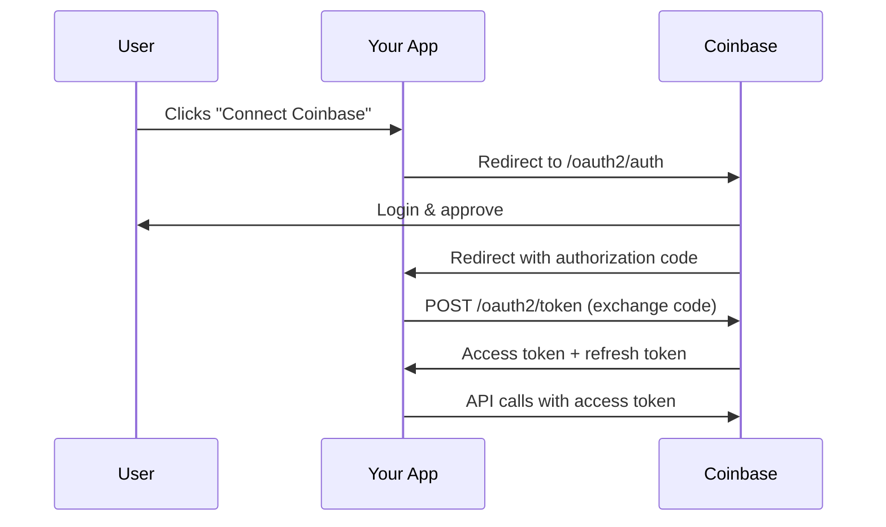

# OAuth2 Integration
Source: https://docs.cdp.coinbase.com/coinbase-app/oauth2-integration/overview

Connect to Coinbase's 100M+ users without sharing their credentials. With OAuth2, users can securely authorize your app to access their accounts, send payments, and trade crypto.

<Warning title="OAuth client access is limited">
  OAuth client creation is currently limited to approved partners. If you'd like to request access please [contact us](https://www.coinbase.com/developer-platform/developer-interest).
</Warning>

<CardGroup>
  <Card title="Payouts" icon="money-bill-transfer" href="#payouts-to-coinbase-users">
    Send payments directly to users' Coinbase accounts—payroll, creator payments, rewards
  </Card>

  <Card title="Pay with Coinbase" icon="wallet" href="#pay-with-coinbase">
    Let users pay with their Coinbase balance or connected payment methods
  </Card>

  <Card title="Trading" icon="chart-line" href="#trading-integration">
    Enable users to trade crypto from within your application
  </Card>
</CardGroup>

## How it works

| Endpoint                           | Purpose                    |
| :--------------------------------- | :------------------------- |
| `login.coinbase.com/oauth2/auth`   | User authorization         |
| `login.coinbase.com/oauth2/token`  | Token exchange & refresh   |
| `login.coinbase.com/oauth2/revoke` | Disconnect user (optional) |

<CardGroup>
  <Card title="Full integration guide" icon="code" href="/coinbase-app/oauth2-integration/integrations">
    Step-by-step implementation with code examples
  </Card>

  <Card title="Security best practices" icon="shield-check" href="/coinbase-app/oauth2-integration/security-best-practices">
    PKCE, state validation, and secure token storage
  </Card>
</CardGroup>

## Before you integrate

<Warning>
  **Plan your scopes upfront.** Scopes must be declared when registering your OAuth application and are difficult to change later. Adding scopes after launch requires users to re-authorize. See [Scopes](/coinbase-app/oauth2-integration/scopes) for the full list.
</Warning>

<Info>
  **Implement PKCE for security.** We strongly recommend implementing [PKCE (Proof Key for Code Exchange)](/coinbase-app/oauth2-integration/security-best-practices#pkce-proof-key-for-code-exchange) in your OAuth2 flow, especially for mobile and single-page applications.
</Info>

## When to use OAuth2

| I want to...                                           | Use                                                                                        |
| :----------------------------------------------------- | :----------------------------------------------------------------------------------------- |
| Access **other users'** Coinbase accounts              | **OAuth2** (this guide)                                                                    |
| Access **my own** CDP resources (server wallets, etc.) | [CDP API Keys](/get-started/authentication/cdp-api-keys)                                   |
| Access **my own** Coinbase account                     | [Coinbase App API Keys](/coinbase-app/authentication-authorization/api-key-authentication) |
| Use a legacy OAuth 1.0 integration                     | **OAuth2** — OAuth 1.0 endpoints are deprecated                                            |

<Info>
  OAuth2 is specifically for third-party applications that need to access Coinbase consumer accounts on behalf of users. If you're building server-side automation for your own account, use API keys instead.
</Info>

## Use cases

### Payouts to Coinbase users

Send payments directly to users' Coinbase accounts—payroll, creator payments, rewards.

**Required scopes:** `wallet:accounts:read`, `wallet:transactions:send`

### Pay with Coinbase

Let users pay for goods and services using their Coinbase balance.

**Required scopes:** `wallet:accounts:read`, `wallet:transactions:send`

### Trading integration

Allow users to trade crypto directly from your platform using their Coinbase account.

**Required scopes:** `wallet:accounts:read`, `wallet:trades:create`, `wallet:trades:read`

