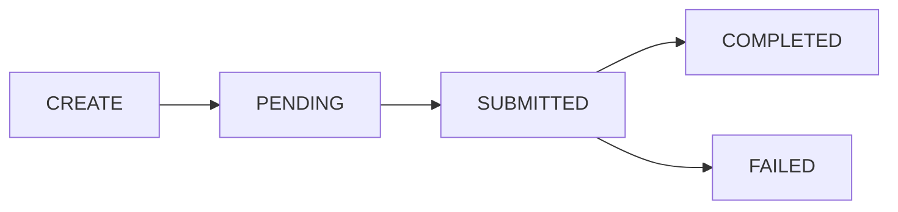

# Upgrade an EOA (EIP-7702)
Source: https://docs.cdp.coinbase.com/embedded-wallets/evm-features/eip-7702-delegation


## Overview

[EIP-7702](https://eips.ethereum.org/EIPS/eip-7702) delegation upgrades an end user's EVM EOA with smart account capabilities — batched transactions, gas sponsorship, and optionally spend permissions — while keeping the same address.

Unlike [ERC-4337 smart accounts](/embedded-wallets/evm-features/smart-accounts), which create a separate contract account, EIP-7702 upgrades your user's **existing EOA in place**.

<Tip>
  If you're new to Embedded Wallets, start with the [Quickstart](/embedded-wallets/quickstart) and [React Hooks](/embedded-wallets/react-hooks) first.
</Tip>

<Tip>
  **Mainnet delegations are sponsored by Coinbase**, so end users do not need to hold any ETH before delegating on Base, Arbitrum, Ethereum, Optimism, or Polygon. Once delegated, pair with the [CDP Paymaster](/paymaster/introduction/welcome) on Base, or any [ERC-7677](https://eips.ethereum.org/EIPS/eip-7677)-compatible paymaster on other networks, to make user operations gasless too.

  **On testnets** (Base Sepolia, Ethereum Sepolia), the delegation transaction requires ETH in the user's EOA. Use the [CDP Faucet](/faucets/introduction/welcome) to fund accounts for testing.
</Tip>

## Operation lifecycle

Delegation is asynchronous. When you create a delegation, the API returns an operation ID immediately while the transaction is submitted and confirmed onchain. You poll the operation until it reaches `COMPLETED`, at which point the account is ready to send user operations.



| Status      | Meaning                                                                         |
| ----------- | ------------------------------------------------------------------------------- |
| `PENDING`   | The delegation operation has been created but not yet submitted to the network. |
| `SUBMITTED` | The delegation transaction has been submitted to the network.                   |
| `COMPLETED` | The delegation is active. The account can now submit user operations.           |
| `FAILED`    | The delegation failed.                                                          |

## Prerequisites

* A CDP Portal account and project
* Node.js 22+ and a package manager (npm, pnpm, or yarn)
* Basic familiarity with React and TypeScript
* A CDP project with Embedded Wallets enabled
* Your app domain [allowlisted](/embedded-wallets/domains)
* `@coinbase/cdp-core`, `@coinbase/cdp-hooks`, and `@coinbase/cdp-api-client` installed

```bash theme={null}
npm install @coinbase/cdp-core @coinbase/cdp-hooks @coinbase/cdp-api-client
```

## Create an EIP-7702 delegation

Use `useCreateEvmEip7702Delegation` to upgrade an end user's EOA. The hook creates the delegation and automatically polls until the operation completes.

```tsx theme={null}
import { EvmEip7702DelegationNetwork } from "@coinbase/cdp-api-client";
import { useCreateEvmEip7702Delegation, useCurrentUser } from "@coinbase/cdp-hooks";

function DelegateAccount() {
  const { createEvmEip7702Delegation, data, status: operation, error } = useCreateEvmEip7702Delegation();
  const { currentUser } = useCurrentUser();

  const handleDelegate = async () => {
    const eoaAddress = currentUser?.evmAccountObjects?.[0]?.address;
    if (!eoaAddress) return;

    try {
      const result = await createEvmEip7702Delegation({
        address: eoaAddress,
        network: EvmEip7702DelegationNetwork["base-sepolia"],
        enableSpendPermissions: false, // set to true to enable spend permissions
      });

      console.log("Delegation started:", result.delegationOperationId);
    } catch (err) {
      console.error("Delegation failed:", err);
    }
  };

  // data is set immediately when the delegation is created;
  // operation is only set once polling reaches a terminal state.
  const isInProgress = !!data && !operation && !error;

  return (
    <div>
      {!data && <p>Ready to delegate</p>}

      {isInProgress && <p>Waiting for delegation to complete...</p>}

      {operation?.status === "COMPLETED" && (
        <div>
          <p>Delegation complete!</p>
          <p>Transaction: {operation.transactionHash}</p>
          <p>Delegate address: {operation.delegateAddress}</p>
        </div>
      )}

      {operation?.status === "FAILED" && <p>Delegation failed. Please try again.</p>}

      {error && <p>Error: {error.message}</p>}

      <button onClick={handleDelegate} disabled={isInProgress}>
        {isInProgress ? "Delegating..." : "Delegate Account"}
      </button>
    </div>
  );
}
```

### Parameters

| Parameter              | Type                          | Description                                                                                                                                                                                     |
| ---------------------- | ----------------------------- | ----------------------------------------------------------------------------------------------------------------------------------------------------------------------------------------------- |
| address                | `string`                      | The user's EOA address to delegate (must belong to the current user).                                                                                                                           |
| network                | `EvmEip7702DelegationNetwork` | Target network. Use the `EvmEip7702DelegationNetwork` enum from `@coinbase/cdp-api-client` (e.g. `EvmEip7702DelegationNetwork["base-sepolia"]`). See [supported networks](#supported-networks). |
| enableSpendPermissions | `boolean`                     | Whether to enable [spend permissions](/embedded-wallets/evm-features/spend-permissions) on the delegated account. Optional, defaults to `false`.                                                |
| idempotencyKey         | `string`                      | An idempotency key for safe retries. Optional.                                                                                                                                                  |

## Check delegation status

### Automatic polling

`useCreateEvmEip7702Delegation` automatically polls for completion. The hook exposes three fields:

* `data` : Set immediately when the delegation is created: `{ delegationOperationId }`. Use this to show a "waiting" state while polling is in progress.
* `status` : The hook's actual property name for the polling result. It holds the full `EvmEip7702DelegationOperation` object (with `.status`, `.transactionHash`, and `.delegateAddress`) once polling reaches a terminal state.
* `error` : Any error from creation or polling.

While `data` is set and `status` is still `null`, the delegation is in flight (the operation is `PENDING` or `SUBMITTED` on the network).

### Manual polling

Use `useWaitForEvmEip7702Delegation` for standalone polling of a delegation operation:

```tsx theme={null}
import { useWaitForEvmEip7702Delegation } from "@coinbase/cdp-hooks";

function DelegationStatus({ delegationOperationId }: { delegationOperationId: string }) {
  const { data, error } = useWaitForEvmEip7702Delegation({
    delegationOperationId,
    enabled: true, // set to false to pause polling
  });

  if (error) return <p>Error: {error.message}</p>;
  if (!data) return <p>Loading...</p>;

  return (
    <div>
      <p>Status: {data.status}</p>
      {data.transactionHash && <p>TX: {data.transactionHash}</p>}
      {data.delegateAddress && <p>Delegate: {data.delegateAddress}</p>}
    </div>
  );
}
```

### One-shot status check

Use `useGetEvmEip7702DelegationOperation` for a single query of the operation status (no polling):

```tsx theme={null}
import { useGetEvmEip7702DelegationOperation } from "@coinbase/cdp-hooks";

function CheckStatus() {
  const { getEvmEip7702DelegationOperation, data, error, status } = useGetEvmEip7702DelegationOperation();

  const handleCheck = async () => {
    await getEvmEip7702DelegationOperation({ delegationOperationId: "your-operation-id" });
  };

  return (
    <div>
      <button onClick={handleCheck}>Check Status</button>
      {data && <p>Status: {data.status}</p>}
    </div>
  );
}
```

## Core SDK actions

The underlying core actions are also available from `@coinbase/cdp-core` for non-React contexts:

```tsx theme={null}
import { createEvmEip7702Delegation, waitForEvmEip7702Delegation, getEvmEip7702DelegationOperation } from "@coinbase/cdp-core";

// Create the delegation
const { delegationOperationId } = await createEvmEip7702Delegation({
  address: eoaAddress,
  network: "base-sepolia",
});

// Wait for completion (polls every 1s, timeout 60s)
const operation = await waitForEvmEip7702Delegation({
  delegationOperationId,
  intervalMs: 2000,   // optional, default: 2000
  timeoutMs: 120000,  // optional, default: 120000
});

// Or check status once
const status = await getEvmEip7702DelegationOperation({ delegationOperationId });
```

### Response: `EvmEip7702DelegationOperation`

| Field                 | Type     | Description                                                     |
| --------------------- | -------- | --------------------------------------------------------------- |
| delegationOperationId | `string` | Unique identifier for the delegation operation.                 |
| status                | `string` | One of: `PENDING`, `SUBMITTED`, `COMPLETED`, `FAILED`.          |
| transactionHash       | `string` | The hash of the delegation transaction. Present once submitted. |
| network               | `string` | The network the delegation was created on.                      |
| delegateAddress       | `string` | The address the account delegated to. Present when active.      |

## Full end-to-end example

This example shows a complete React component that delegates a user's EOA and displays the result.

<Accordion title="Complete delegation component">
  ```tsx theme={null}
  import { EvmEip7702DelegationNetwork } from "@coinbase/cdp-api-client";
  import { useCreateEvmEip7702Delegation, useCurrentUser } from "@coinbase/cdp-hooks";

  function EIP7702Delegation() {
    const { createEvmEip7702Delegation, data, status: operation, error } = useCreateEvmEip7702Delegation();
    const { currentUser } = useCurrentUser();

    const eoaAddress = currentUser?.evmAccountObjects?.[0]?.address;
    const hasEoaAccount = !!currentUser?.evmAccountObjects?.length;

    // data is set when delegation is created; operation is only set at a terminal state.
    const isInProgress = !!data && !operation && !error;

    const handleDelegate = async () => {
      if (!eoaAddress) return;

      try {
        await createEvmEip7702Delegation({
          address: eoaAddress,
          network: EvmEip7702DelegationNetwork["base-sepolia"],
          enableSpendPermissions: false,
        });
      } catch (err) {
        console.error("Delegation failed:", err);
      }
    };

    return (
      <div>
        <h2>EIP-7702 Delegation</h2>

        {!currentUser && <p>Please sign in first.</p>}

        {currentUser && !hasEoaAccount && <p>No EOA account found.</p>}

        {eoaAddress && (
          <div>
            <p>EOA: {eoaAddress}</p>

            <button onClick={handleDelegate} disabled={!currentUser || !hasEoaAccount || isInProgress}>
              {isInProgress ? "Delegating..." : "Upgrade to Smart Account"}
            </button>

            {data?.delegationOperationId && <p>Operation ID: {data.delegationOperationId}</p>}

            {isInProgress && <p>Waiting for delegation to complete...</p>}

            {operation?.status === "COMPLETED" && (
              <div>
                <p>Delegation complete!</p>
                {operation.transactionHash && <p>Transaction: {operation.transactionHash}</p>}
                {operation.delegateAddress && <p>Delegate: {operation.delegateAddress}</p>}
                <p>Your EOA now has smart account capabilities.</p>
              </div>
            )}

            {operation?.status === "FAILED" && (
              <p>Delegation failed. Please try again.</p>
            )}

            {error && <p>Error: {error.message}</p>}
          </div>
        )}
      </div>
    );
  }
  ```
</Accordion>

## React hooks reference

| Hook                                  | Description                                                 |
| ------------------------------------- | ----------------------------------------------------------- |
| `useCreateEvmEip7702Delegation`       | Create a delegation and automatically poll until completion |
| `useWaitForEvmEip7702Delegation`      | Poll a delegation operation status (standalone)             |
| `useGetEvmEip7702DelegationOperation` | One-shot query of operation status                          |

<Note>
  Questions? Contact us in the #embedded-wallets channel on [Discord](https://discord.gg/cdp).
</Note>

## Supported networks

<CardGroup>
  <Card title="Mainnets" icon="globe">
    Arbitrum, Base, Ethereum, Optimism, Polygon

    Delegation transactions are **sponsored by Coinbase**, so no ETH is required. Pair with the [CDP Paymaster](/paymaster/introduction/welcome) on Base, or a custom [ERC-7677](https://eips.ethereum.org/EIPS/eip-7677) paymaster on other networks, for fully gasless user operations.
  </Card>

  <Card title="Testnets" icon="flask">
    Base Sepolia, Ethereum Sepolia

    The user's EOA must hold ETH to pay for the delegation transaction. Use the [CDP Faucet](/faucets/introduction/welcome) to fund accounts for testing.
  </Card>
</CardGroup>

## EIP-7702 vs ERC-4337 smart accounts

| Aspect                | EIP-7702 Delegation                      | ERC-4337 Smart Account                |
| --------------------- | ---------------------------------------- | ------------------------------------- |
| **Address**           | Same EOA address, upgraded in place      | New contract address                  |
| **Account type**      | EOA with smart account capabilities      | Standalone smart contract             |
| **Creation**          | Delegation operation on existing account | Separate smart account creation       |
| **User operations**   | Supported after delegation               | Supported after first user operation  |
| **Spend permissions** | Optional via `enableSpendPermissions`    | Optional via `enableSpendPermissions` |

## What to read next

* [**Smart Accounts**](/embedded-wallets/evm-features/smart-accounts): Learn about ERC-4337 Smart Accounts
* [**Spend Permissions**](/embedded-wallets/evm-features/spend-permissions): Configure spending limits for delegated accounts
* [**React Hooks**](/embedded-wallets/react-hooks): Explore all available hooks for embedded wallets

